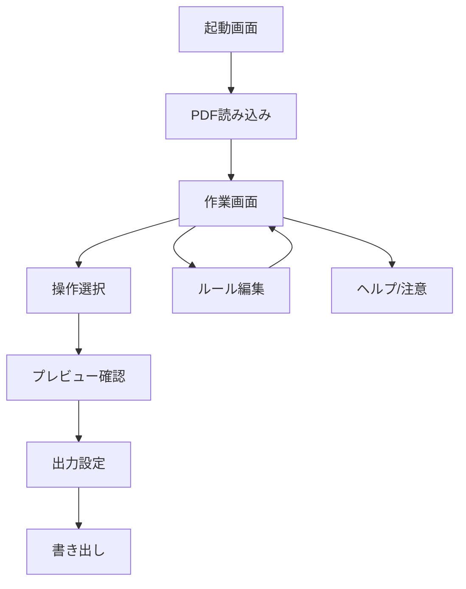

# SMSV PDF Tools 画面設計

## ねらい

このツールは、PDF を「読む」「まとめる」「分ける」「回す」「名前を整える」ための作業台にする。

画面は複雑にしすぎず、次の 3 つを最優先にする。

- 何を入力したかが一目で分かる
- どのページに何をするかが分かる
- 変換後の出力名と PDF 内タイトルが分かる

## 画面設計の基本方針

### 1. 1つのメイン画面で完結させる

初期版は画面遷移を増やしすぎない。
基本は 1 つの作業画面で、必要に応じて右側の詳細パネルやモーダルを開く。

### 2. 「入力」「編集」「出力」を分ける

- 入力: PDF 読み込み
- 編集: ページ操作、分割、回転、メタデータ変更
- 出力: ファイル名、保存、書き出し

### 3. 単発操作と一括ルールを両立する

初心者にはボタン操作、上級者にはルールプリセットを用意する。

### 4. 端末内処理を前提に注意を見える化する

大量ページや大容量 PDF は、処理時間とメモリの注意を常に見える場所に出す。

## 情報設計

### 表示する主情報

- ファイル名
- PDF 内タイトル
- ページ数
- 容量
- 向き
- ページサイズ
- 暗号化の有無
- 処理モード
- 出力名

### 常に見えるべき状態

- 選択中ページ
- 適用予定の操作
- ルールの有効/無効
- 出力先のファイル名
- 警告の有無

## 画面一覧

### A. 起動画面

役割:

- アプリの目的を示す
- PDF を読み込む
- サンプルやヘルプへ進む

表示要素:

- ロゴと名称
- PDF ドロップエリア
- 「ファイルを選択」ボタン
- 最近使ったプリセット
- 注意文

### B. 作業画面

役割:

- ほぼすべての作業をここで行う

表示要素:

- 上部バー
- 左ペイン: 読み込み済みファイル一覧
- 中央: ページサムネイルと選択ページ
- 右ペイン: 操作詳細
- 下部: 実行・書き出しボタン

### C. 出力設定ダイアログ

役割:

- 保存名とメタデータの最終確認

表示要素:

- 保存ファイル名
- PDF タイトル
- Author / Subject / Keywords
- 作成日時 / 更新日時
- 透かしや注意文の表示
- 書き出し実行

### D. ルール編集ダイアログ

役割:

- 一括処理ルールの保存と再利用

表示要素:

- ルール名
- 対象ページ
- 操作の並び
- プレビュー
- 保存先プリセット

### E. ヘルプ/注意画面

役割:

- 安全な使い方を説明する

表示要素:

- 端末内処理の説明
- 著作権と真正性の注意
- メタデータ変更の注意
- よくある質問

## 画面フロー



## 作業画面のレイアウト

### デスクトップ

3 カラム構成にする。

```text
┌──────────────────────────────────────────────────────────────┐
│ 上部バー: ロゴ / ファイル追加 / プリセット / ヘルプ       │
├──────────────┬──────────────────────────┬───────────────────┤
│ 左ペイン      │ 中央キャンバス           │ 右ペイン           │
│ ファイル一覧   │ サムネイル / 選択ページ  │ 操作詳細 / ルール   │
│ プリセット     │ 2-in-1 プレビュー       │ メタデータ         │
├──────────────┴──────────────────────────┴───────────────────┤
│ 下部バー: 実行 / 書き出し / 進捗 / 警告                      │
└──────────────────────────────────────────────────────────────┘
```

#### 左ペイン

目的:

- 入力済み PDF の確認
- 複数ファイルの切り替え
- まとめ処理の対象把握

内容:

- ファイル名
- ページ数
- 容量
- 選択状態
- 削除ボタン

#### 中央キャンバス

目的:

- ページを視覚的に扱う
- 分割や回転の結果を確認する

内容:

- ページサムネイル一覧
- 選択ページの大きなプレビュー
- 2-in-1 分割のガイド線
- ドラッグで並べ替え

#### 右ペイン

目的:

- 選択ページに対する操作を設定する

内容:

- 操作カテゴリ
- 回転角度
- 分割方向
- 分割位置
- 適用対象
- メタデータ編集
- 名前テンプレート

#### 下部バー

目的:

- 最後の実行導線を固定する

内容:

- 進捗
- 警告表示
- プレビュー更新
- 実行
- 書き出し

### モバイル / iPad

横幅が狭いときは 1 カラムに切り替える。

順番は次の通り。

1. 読み込みエリア
2. 現在のファイル情報
3. ページプレビュー
4. 操作パネル
5. 出力設定

右ペインは下からせり上がるボトムシートに変える。

## 主要コンポーネント

### 1. FileDropZone

役割:

- PDF の読み込み

状態:

- 空
- ドラッグ中
- 読み込み中
- 読み込み完了
- エラー

### 2. DocumentSummaryCard

役割:

- 読み込んだ PDF の概要表示

表示:

- ファイル名
- タイトル
- ページ数
- 容量
- 向き
- サイズ

### 3. PageThumbnailGrid

役割:

- ページを一覧で見せる

機能:

- ページ選択
- 複数選択
- ドラッグ移動
- 回転マーク表示
- 分割予定マーク表示

### 4. OperationPanel

役割:

- 回転、分割、削除、並べ替えを操作する

構成:

- 操作種別
- 対象ページ
- 詳細設定
- 適用ボタン

### 5. MetadataEditor

役割:

- PDF 内部情報を編集する

項目:

- Title
- Author
- Subject
- Keywords
- Creator
- Producer
- CreationDate
- ModificationDate

### 6. FilenameTemplateEditor

役割:

- 出力ファイル名をテンプレートで決める

特徴:

- 変数挿入
- プレビュー表示
- 連番確認

### 7. RulePresetPanel

役割:

- よく使う処理を保存する

例:

- 見開き分割
- 奇数ページ回転
- 両面スキャン整列
- SMSV 用変換

## 状態設計

### 空状態

- まだ PDF がない
- 読み込みボタンを強く出す
- 使い方を短く示す

### 読み込み中

- 進捗バーを表示
- ページ数の多いファイルは長くかかることを示す

### 編集中

- 選択中ページを明示する
- 適用予定の処理を一覧化する

### 警告状態

- 大容量
- 大ページ数
- メタデータの注意
- 完全な真正性を保証しない注意

### 出力準備完了

- 保存名の確認
- 変換内容の要約
- 「書き出し」ボタンを強調

## 代表的な操作フロー

### フロー 1: 回転

1. PDF 読み込み
2. ページ選択
3. 回転角度を指定
4. プレビュー確認
5. 書き出し

### フロー 2: 見開き分割

1. PDF 読み込み
2. 2-in-1 分割を選ぶ
3. 分割方向と位置を指定
4. 左右順序を決める
5. 全ページまたは一部に適用
6. 書き出し

### フロー 3: 一括ルール

1. PDF 読み込み
2. ルールプリセットを選ぶ
3. 必要なら対象ページを微調整
4. プレビュー確認
5. 保存して実行

### フロー 4: 名前とメタデータ変更

1. PDF 読み込み
2. 出力名テンプレートを入力
3. PDF タイトルを編集
4. 必要なメタデータを編集
5. 最終確認して書き出し

## 文字情報の優先順位

画面で最も大きく出すべきなのは次の順。

1. 選択中 PDF の名前
2. 選択中ページ番号
3. 予定している操作
4. 出力ファイル名
5. PDF 内タイトル

## 見た目の方向性

### 印象

- 事務的すぎず、道具感がある
- 迷いを減らす
- PDF を扱う専門ツールらしい落ち着き

### 色の使い方

- 背景は落ち着いた中間色
- 実行ボタンは 1 色に絞る
- 警告は赤ではなく橙系を基本にする
- 成功は緑系で控えめに出す

### 余白

- 一画面に情報を詰め込みすぎない
- 一度に見せる設定は最大 5 個前後に絞る

## 初期版の画面優先順位

最初に作るべき画面はこの順。

1. 起動画面
2. 作業画面
3. 出力設定ダイアログ
4. ルール編集ダイアログ
5. ヘルプ/注意画面

## MVP で省いてよいもの

- アカウント機能
- クラウド保存
- 共同編集
- 高度なテンプレートマクロ
- OCR
- 画像再構成による高品質補正
- ネットワーク共有機能

## 画面設計の結論

このツールは、次の構成がもっとも扱いやすい。

- 入口はシンプルな読み込み画面
- 実作業は 1 つのワークスペースで完結
- ページ一覧と詳細設定を左右に分ける
- 出力時だけファイル名とメタデータをまとめて確認する
- 重い処理や危険な誤用は、常に注意を見せる

## 次の作業候補

1. この画面設計を元にワイヤーフレームを起こす
2. そのまま React のコンポーネント構成に落とす
3. まずは MVP の画面だけに絞ってさらに削る
